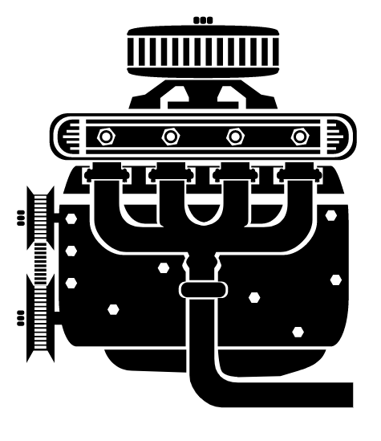

# README for README.md Doc Generator

---

---
⚠️ -- WARNING! THIS README BLOWS MINDS -- ⚠️ 

⚠️ -- WARNING! HAVING BRAINS IS REQUIRED -- ⚠️ 
---
## Table of Contents
- [Heading](#project-readme-heading)
- [Project Downstream Distribution Home](#project-distribution-home)
- [Project Origin Home](#project-origin-home)
- [Project Justification](#project-justification)
- [Beginner Use-Cases](#beginner-use-cases)
- [Expert Use-Cases](#expert-use-cases)
- [Attributions](#attributions)
---
# Project README Heading
- Creation Date: Feb 1, 2018
- Location: New York City, 10027
- [projectMaintainer](https://www.github.com/jeremy-donson/)
- [projectContributor](https://www.github.com/temickab/)
- [barterMaster](https://www.github.com/jeremy-donson/)

## Project Distribution Home
[Project Downstream Distribution Home](https:///urbanspectra/readme-generator)

## Project Origin Home
[Project Origin Home](https://bitbucket.org/urbanspectra/temicka-brown-reboot)

## Project Justification

## Beginner Use-Cases

## Expert Use-Cases

### 

1. $ cd ..                                  # Get out of current project that is messy
2. $ mv PROJDIR PROJDIR-old                 # Rename folder where you made git spaghetti.  :)
3. $ git clone https://PROJ-REPO-URL        # Reclone project from remote github.
4. $ cd PROJDIR-old                         # Enter old renamed project folder.
=> get on the right branch
=> $ git log
to see what to diff and gather 

## Attributions
- [One SWEET README.md](https://github.com/teles/array-mixer)
- [Another SWEET README.md]()
- [Heading SVG Graphic](http://www.clker.com/cliparts/W/N/P/7/p/3/engine.svg)
- [Gallery of Great README Examples](https://github.com/matiassingers/awesome-readme)
- [Fine Source of Markdown Cheats](https://github.com/adam-p/markdown-here/wiki/Markdown-Cheatsheet)
- [OWNER](https://www.github.com/jeremy-donson/)

©2018 [Jeremy J Donson](https://www.github.com/jeremy-donson/), New York City, 20017