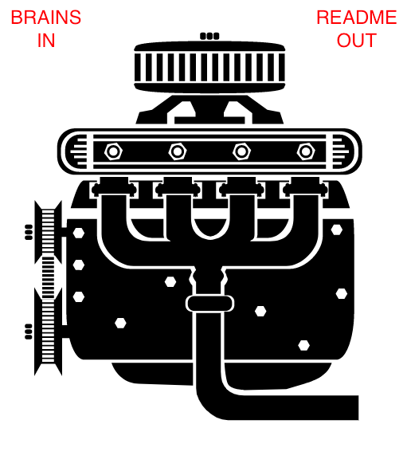

# README for README.md Doc Generator

---
⚠️ &nbsp;&nbsp; WARNING! THIS README BLOWS MINDS! &nbsp;&nbsp; ⚠️ 
---
⚠️ &nbsp;&nbsp; WARNING! HAVING BRAINS IS A MANDATORY PREREQUISITE! &nbsp;&nbsp; ⚠️ 
---
## Table of Contents
- [Heading](#project-readme-heading)
- [Project Downstream Distribution Home](#project-distribution-home)
- [Project Origin Home](#project-origin-home)
- [Project Justification](#project-justification)
- [Beginner Use-Cases](#beginner-use-cases)
- [Expert Use-Cases](#expert-use-cases)
- [How To Get One For Very Little Money](#how-to-get-one-for-very-little-money)
- [How To Get One For Cheap or Free](#how-to-get-one-for-cheap-or-free)
- [Contributors](#contributors)
- [Enhancements](#enhancements)
- [Attributions](#attributions)
---
# Project README Heading
- Creation Date: Feb 1, 2018
- Location: New York City, 10027
- [projectMaintainer](https://www.github.com/jeremy-donson/)
- [projectContributor](https://www.github.com/temickab/)
- [barterMaster](https://www.github.com/jeremy-donson/)

## Project Distribution Home
[Project Downstream Distribution Home](https:///urbanspectra/readme-generator)

## Project Origin Home
[Project Origin Home](https://bitbucket.org/urbanspectra/temicka-brown-reboot)

## Project Justifications
+ [Github speaks quite lucidly](https://help.github.com/articles/about-readmes/) about README's, repository licenses, contribution guidelines, and codes of conduct.
- README docs tend to be about WHAT and HOW. Justifications regard "WHY". Well, WHY WHAT?
- [What ARE Git and Github?]()
- [What ARE Open Source and Linux?]()
- [Why Should I Care?]()
- [Why Are READMEs Important?]()
- [Why Are READMEs Important To Whom?]()
- [Are All READMEs Rated The Same Way?]()
- [What makes READMEs Effective?]()
- [How Do READMEs Design Goals Vary?]()
- [How many kinds of READMEs Are There?]()
- [Practical Justifications]()
- [Ethical Justifications]()

## Beginner Use-Cases

And that is what this work IS.
Save others time, and they are to do the same in kind.

I like that ethic, both personally and professionally.
Instead, for everyone to be wasting time, each with their own version of the exact same problem?  NO thx!~ . 😀

## Expert Use-Cases

## How To Get One For Very Little Money

## How To Get One For Cheap or Free

## Contributors

## Enhancements
- [ ]: Improve audience types.
- [ ]: Improve audience types.
- [ ]: Improve audience types.

## Attributions
- [Heading SVG Graphic](http://www.clker.com/cliparts/W/N/P/7/p/3/engine.svg)
- [Complete Github Markdown Emoji Markup](https://gist.github.com/rxaviers/7360908)
- [One SWEET README.md](https://github.com/teles/array-mixer)
- [Another SWEET README.md](https://github.com/facebook/create-react-app)
- [Gallery of Great README Examples](https://github.com/matiassingers/awesome-readme)
- [Fine Source of Markdown Cheats](https://github.com/adam-p/markdown-here/wiki/Markdown-Cheatsheet)
- [Github Docs About READMEs (Redundant, NO? :D )](https://help.github.com/articles/about-readmes/)
- [barterEngine]()
- [OWNER](https://www.github.com/jeremy-donson/)

©2018 [Jeremy J Donson](https://www.github.com/jeremy-donson/), New York City, 20017